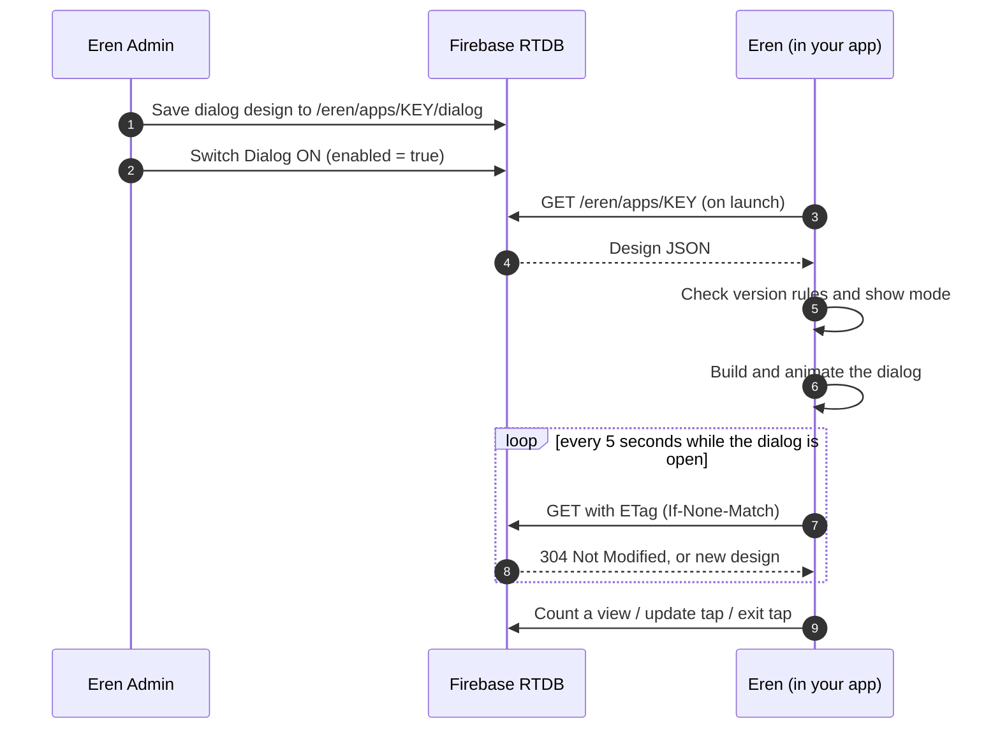

<!--
  Before you publish:
  1. Replace TanzirEren/Eren_Update_Dialog in the build badge below.
  2. Keep the assets/ folder next to this file (animated banner and diagrams live there).
-->

<p align="center">
  
</p>

<p align="center">
  
  
  
  
</p>

<p align="center">
  <a href="https://github.com/TanzirEren/Eren_Update_Dialog/actions/workflows/build.yml">
    
  </a>
</p>

<p align="center">
  <b>Design an update dialog on your phone. Show it inside your Android app. Change it any time without rebuilding.</b>
</p>


## Contents

- [What is Eren?](#what-is-eren)
- [The two apps](#the-two-apps)
- [How it works](#how-it-works)
- [Features](#features)
- [Quick start](#quick-start)
- [Patching Eren with MT Manager](#patching-eren-with-mt-manager)
- [Using Eren inside another app](#using-eren-inside-another-app)
- [Admin app guide](#admin-app-guide)
- [Animation reference](#animation-reference)
- [Dialog settings reference](#dialog-settings-reference)
- [Database structure](#database-structure)
- [Limits and good to know](#limits-and-good-to-know)
- [Security](#security)
- [Build it yourself](#build-it-yourself)
- [Project structure](#project-structure)
- [Troubleshooting](#troubleshooting)
- [FAQ](#faq)
- [বাংলা সংক্ষেপ](#বাংলা-সংক্ষেপ)
- [Credits](#credits)


## What is Eren?

Eren is a small system for showing a beautiful **"Update available"** dialog inside any Android app, and controlling it remotely.

You design the dialog in **Eren Admin** (a phone app) with a live preview. The design is saved to your own **Firebase Realtime Database**. The **Eren** dialog inside your app reads that design and shows it. Change a color, a line of text, the image or the animation in the admin app, press Save, and open dialogs update in a few seconds.

No Firebase SDK, no `google-services.json`, no extra libraries. Everything is plain native Java talking to the Firebase REST API.

<p align="center">
  
</p>

## The two apps

| | **Eren** | **Eren Admin** |
|---|---|---|
| Purpose | The dialog that your users see | The control panel you use |
| Package | `com.eren.dialog` | `com.eren.admin` |
| Main files | `MainActivity.java`, `Eren.java` | `MainActivity.java`, `Editor.java`, `Eren.java`, `U.java`, `Db.java`, `Pal.java` |
| Entry call | `Eren.show(this);` | Open the app |
| Min / target SDK | 21 / 34 | 21 / 34 |
| Output | One APK with a single `classes.dex` | One APK |

> [!NOTE]
> `Eren.java` is the same code in both apps (only the package line differs). The admin app uses it to draw the **live preview**, so the preview always matches what users see.

## How it works



1. **Per-app key.** Every app you add gets a unique key like `MM-7QK-3XD-9PA-ST`. The Eren inside that app only reads its own key.
2. **Enable switch.** The dialog shows only while **Dialog** is ON for that app.
3. **Live edits.** While the dialog is open, Eren checks for changes every 5 seconds using an ETag, so unchanged data costs almost nothing.
4. **Turn it off.** When everyone has updated, switch the dialog OFF in the admin app (or use the version rule).


## Features

### Eren (dialog)

| Area | What you get |
|---|---|
| **Look** | Same design as the original MODMASE HTML dialog: media on top with soft fade, small title, big two-color name, feature card, EXIT and UPDATE buttons |
| **Size** | Compact by default (76% of screen width, max 400 dp). Everything inside scales together, so proportions stay perfect |
| **Media** | Image or **video** (muted, looping, center-cropped). From a URL or uploaded from the phone gallery |
| **Fonts** | Bundled in `assets/fonts`: Audiowide, Oswald, Poppins (Bold and SemiBold), Righteous, Bungee, Orbitron |
| **Animation** | 21 entrance effects, 9 easings, stagger, exit effect, button press effect, attention loops. One master on/off switch |
| **Behavior** | Show every launch, once per day, or once per save. Version targeting. Optional close (X) button. Force-update mode (hide EXIT) |
| **Exit** | Closes the whole app, or just dismisses the dialog |
| **Counters** | Anonymous totals: dialog views, update taps, exit taps, last seen |
| **Single dex** | The APK is built with one `classes.dex` and no multidex |
| **Smali friendly** | The database URL and the app key are two plain strings you can replace in `Eren.smali` |

### Eren Admin

| Area | What you get |
|---|---|
| **Login** | Connect with your `databaseURL`, create a private access key (eye icon to show/hide), unlock with it next time. Optional "Stay signed in" |
| **Dashboard** | Connection ping, totals (apps, live, off), live dialogs, recent apps, animated counters |
| **Apps** | Search, sort (newest, A-Z, live first), floating **+** button, app cards with icon, name, detail and LIVE/OFF badge |
| **App page** | Icon, name, detail, date, **App Connect Key**, `databaseURL`, `INTERNET` permission line (all with one-tap copy), activity counters, Dialog ON/OFF, edit, duplicate, delete |
| **Editor** | Live preview on top, **Play** (replay animation), **Test** (full-screen) and 11 settings sections (see below) |
| **Auto colors** | Reads colors from your image or a video frame and styles the whole dialog. Tap another swatch to try a different main color |
| **Gallery** | Pick an image or a video from your gallery. Pick an app icon from the gallery too |
| **Extras** | Copy dialog from another app, copy/paste JSON, duplicate app, export all apps, change access key |
| **Design** | Light, Material-style, rounded cards, smooth animations, animation on/off, 6 accent colors |


## Quick start

### 1. Create the Firebase database

1. Open the [Firebase Console](https://console.firebase.google.com/), create a project, then **Build > Realtime Database > Create database**.
2. Copy the URL shown at the top, for example `https://my-project-default-rtdb.firebaseio.com`. This is your **databaseURL**.
3. Open the **Rules** tab and paste:

```json
{
  "rules": {
    "eren": { ".read": true, ".write": true }
  }
}
```

4. Press **Publish**. (See [Security](#security) for what this means.)

### 2. Build the APKs

1. Push this repository to GitHub.
2. Open the **Actions** tab. The workflow **Build Eren + Eren Admin** runs on every push (or press **Run workflow**).
3. When it finishes, download the artifacts `Eren-APK` and `ErenAdmin-APK`. Each contains `app-debug.apk` and `app-release.apk`.

### 3. Set up the admin app

1. Install **Eren Admin**.
2. Paste your `databaseURL` and press **Connect**.
3. Create your **access key** (minimum 6 characters) and keep it safe. It cannot be recovered.

### 4. Add your app

1. Open the **Apps** tab and press the floating **+**.
2. Enter the app name, a short detail and an icon URL (or pick an icon from the gallery). The date is filled automatically.
3. Open the new app card. You will see:
   - **App Connect Key**, for example `MM-7QK-3XD-9PA-ST`
   - **Firebase databaseURL**
   - **INTERNET permission** line

### 5. Put the values into Eren

Follow [Patching Eren with MT Manager](#patching-eren-with-mt-manager), or [use Eren inside another app](#using-eren-inside-another-app).

### 6. Design and go live

1. In the app page press **Edit** and design the dialog with the live preview.
2. Press **Save changes**.
3. Switch **Dialog** to **ON**.
4. Open the Eren app. The dialog appears. Edit again in the admin app and watch it update.


## Patching Eren with MT Manager

The built Eren APK has two strings you replace: the database URL and your app key.

1. Open the `Eren` APK in **MT Manager** and tap **View**.
2. Tap `classes.dex` and choose **DEX Editor++**.
3. Go to `com` > `eren` > `dialog` and open **`Eren.smali`** with **Edit**.
4. Search for `YOUR-PROJECT`. In the static constructor (`<clinit>`) you will find:

```smali
const-string v0, "https://YOUR-PROJECT-default-rtdb.firebaseio.com"
sput-object v0, Lcom/eren/dialog/Eren;->DB_URL:Ljava/lang/String;

const-string v0, "MM-XXX-XXX-XXX-ST"
sput-object v0, Lcom/eren/dialog/Eren;->APP_KEY:Ljava/lang/String;
```

5. Replace the text **inside the quotes** with your `databaseURL` and your App Connect Key. Do not change anything else on those lines.
6. Save, go back, compile the dex, and let MT Manager sign the APK.
7. Uninstall any older Eren (different signature), then install the patched APK.

> [!TIP]
> No trailing `/` and no `.json` at the end of the URL. The key must match exactly, including the dashes.

## Using Eren inside another app

You can add the dialog to an existing APK with smali.

1. **Copy classes.** From the Eren APK copy `Eren.smali` and every `Eren$*.smali` into the target app under `com/eren/dialog/`. Keep them together.
2. **Copy fonts.** Copy the files from Eren's `assets/fonts/` into the target app's `assets/fonts/`. Without them the dialog falls back to a plain bold font.
3. **Add the permission** to the target `AndroidManifest.xml` if it is missing:

```xml
<uses-permission android:name="android.permission.INTERNET"/>
```

4. **Hook it** at the end of any Activity's `onCreate` (before `return-void`):

```smali
invoke-static {p0}, Lcom/eren/dialog/Eren;->show(Landroid/app/Activity;)V
```

5. Replace `DB_URL` and `APP_KEY` in `Eren.smali` as shown above.

If you have Java source, simply add `Eren.java` to your project and call:

```java
Eren.show(this);   // e.g. at the end of onCreate
```

Optionally call `Eren.stop();` in `onDestroy()`.


## Admin app guide

### Screens

| Screen | What it does |
|---|---|
| **Connect** | Enter your `databaseURL`. The app checks it and moves on |
| **Create key / Unlock** | Set or enter the private access key (eye icon to reveal) |
| **Home** | Dashboard with connection ping, stats, live dialogs and recent apps |
| **Apps** | Search, sort, add, open. The **+** button adds an app |
| **App page** | Keys, copy buttons, counters, Dialog switch, edit, duplicate, delete |
| **Editor** | Everything about the dialog, with live preview |
| **Guide** | Built-in step-by-step help and the database rules |
| **Settings** | Accent color, animations, stay signed in, change key, test connection, export, disconnect |

### Editor sections

| # | Section | Controls |
|---|---|---|
| 1 | **Image / Video** | URL, image/video type, gallery image, gallery video, remove, shape (16:9, 3:2, 1:1, 4:5, 9:16), recommended size, bottom fade |
| 2 | **Auto colors** | Match colors to media, tappable swatches, auto-match toggle |
| 3 | **Dialog size** | Width % of screen, media height %, overall scale %, corner radius |
| 4 | **Title and name** | Small title, name part 1, colored part 2, sub line, name size |
| 5 | **Feature lines** | Add, edit, remove lines, bullet symbol |
| 6 | **Buttons** | Texts, update URL, show/hide EXIT, side-by-side or stacked, height, width %, corner radius, border thickness, gap, text size, shadow |
| 7 | **Colors** | 9 category presets, HEX fields, palette, 14 color slots (backdrop, card, name, accent, buttons, borders, texts), backdrop opacity |
| 8 | **Fonts** | Font per element (small title, name, features, buttons), small title size, feature size |
| 9 | **Animation** | Master switch, entrance, duration, delay, intensity, easing, stagger, exit, press, attention |
| 10 | **Behavior** | Show mode, exit action, close (X) button, back button, version targeting |
| 11 | **Tools** | Copy JSON, paste JSON, copy dialog from another app |

### Category presets

`Default` · `Ocean` · `Forest` · `Sunset` · `Purple` · `Gold` · `Rose` · `Dark` · `Mono`

## Animation reference

Turn everything on or off with the **Animations** switch. Use **Play** in the editor to replay.

### Entrance effects (21)

| | | | | | | |
|---|---|---|---|---|---|---|
| Fade | Slide up | Slide down | Slide left | Slide right | Zoom in | Zoom out |
| Pop | Bounce | Drop | Flip X | Flip Y | Rotate | Spin zoom |
| Swing | Jelly | Elastic | Roll | Unfold | Stretch | Tilt |

### Controls

| Setting | Range / options |
|---|---|
| Duration | 100 - 2500 ms |
| Start delay | 0 - 2000 ms |
| Intensity | 10 - 200 % |
| Easing | Auto, Smooth, Fast-slow, Overshoot, Bounce, Elastic, Anticipate, Linear, Speed up |
| Stagger | On/off and 0 - 400 ms gap (title, name, list, buttons appear one by one) |
| Exit effect | None, Fade + zoom, Slide down, Slide up, Spin |
| Button press | Scale, Bounce, None |
| Update button attention | None, Pulse, Shake, Wobble, Float, Glow (speed 300 - 4000 ms) |


## Dialog settings reference

All settings are stored as JSON in `eren/apps/<KEY>/dialog`. Every field is optional; missing fields use the default.

<details>
<summary><b>Media, size, text</b></summary>

| Key | Default | Meaning |
|---|---|---|
| `media` | `""` | `https://...` URL, or `rtdb:<id>` for a gallery upload |
| `mediaType` | `image` | `image` or `video` |
| `heroH` | `52` | Media height as % of dialog width |
| `heroFade` | `true` | Soft fade at the bottom of the media |
| `widthPct` | `76` | Dialog width as % of screen (max 400 dp) |
| `uiScale` | `100` | Overall scale of everything inside (60 - 140) |
| `radius` | `31` | Card corner radius |
| `small` | `UPDATE` | Small title |
| `brand1` / `brand2` | `MOD` / `MASE` | Name, first part and colored part |
| `subtitle` | `""` | Optional line under the name |
| `features` | 2 lines | Array of strings |
| `symbol` | `❖` | Bullet symbol |
| `brandSize`, `smallSize`, `featureSize`, `subSize` | 56, 16, 15, 13 | Text sizes (design dp, scaled) |

</details>

<details>
<summary><b>Buttons</b></summary>

| Key | Default | Meaning |
|---|---|---|
| `exitText` / `updateText` | `EXIT` / `UPDATE` | Labels |
| `updateUrl` | `""` | Opened when UPDATE is tapped |
| `showExit` | `true` | Hide EXIT for a forced update |
| `btnLayout` | `row` | `row` or `column` |
| `btnH` | `55` | Height |
| `btnW` | `100` | Width as % of the card content |
| `btnRadius` | `19` | Corner radius |
| `btnBorder` | `3` | Border thickness |
| `btnGap` | `12` | Gap between buttons |
| `btnSize` | `17` | Text size |
| `btnShadow` | `false` | Shadow under buttons |

</details>

<details>
<summary><b>Colors and fonts</b></summary>

| Key | Meaning |
|---|---|
| `backdrop`, `dim` | Page color behind the dialog and its opacity (0 - 100) |
| `card` | Dialog and feature card color |
| `text` | Name, first part |
| `accent` | Name, colored part |
| `updateBg`, `btnText` | UPDATE button color and text color |
| `exitBg`, `exitFg` | EXIT button color and text color |
| `border`, `exitBorder`, `updateBorder` | Border colors (both, or each button) |
| `featureText`, `smallColor`, `subColor` | Text colors |
| `fontSmall`, `fontBrand`, `fontFeature`, `fontButton` | File names in `assets/fonts` without `.ttf` |

Available fonts: `Audiowide-Regular`, `Oswald-Variable`, `Poppins-Bold`, `Poppins-SemiBold`, `Righteous-Regular`, `Bungee-Regular`, `Orbitron-Variable`.

</details>

<details>
<summary><b>Animation and behavior</b></summary>

| Key | Default | Meaning |
|---|---|---|
| `animOn` | `true` | Master switch |
| `animIn` | `zoom_in` | Entrance effect id |
| `animDur`, `animDelay`, `animPower` | 420, 0, 60 | Duration, delay, intensity |
| `animEase` | `auto` | Easing id |
| `animStagger`, `animStaggerMs` | `true`, 70 | Content stagger |
| `animOut` | `zoom` | `none`, `zoom`, `slide_down`, `slide_up`, `spin` |
| `press` | `scale` | `scale`, `bounce`, `none` |
| `attn`, `attnMs` | `none`, 1200 | `pulse`, `shake`, `wobble`, `float`, `glow` |
| `exitAction` | `close` | `close` (closes the app) or `dismiss` |
| `showClose` | `false` | Show the top-right X |
| `cancelable` | `false` | Back button closes the dialog |
| `showMode` | `always` | `always`, `daily`, `once` (once per save) |
| `minVersion` | `0` | Show only if the app `versionCode` is below this. `0` = everyone |
| `rev` | auto | Set on every save, used by `once` |

</details>

## Database structure

```text
eren
├── admin
│   ├── keyHash          SHA-256 of your access key (the key itself is never stored)
│   └── created
├── apps
│   └── MM-XXX-XXX-XXX-ST
│       ├── name, detail, icon, date, created
│       ├── enabled      true / false  (the Dialog switch)
│       └── dialog       { ...settings... }
├── media
│   └── <id>             { mime, size, data (base64) }   gallery image / video uploads
└── stats
    └── MM-XXX-XXX-XXX-ST
        └── shown, updates, exits, last
```

Counters live outside `apps/` on purpose, so a counter change never makes an open dialog redraw.

## Limits and good to know

| Topic | Detail |
|---|---|
| Gallery image | Resized to at most 1200 px wide and compressed to about 380 KB, then uploaded to `eren/media` |
| Gallery video | Up to **6 MB**. For bigger files use a direct `.mp4` URL |
| Icon from gallery | Cropped square, 192 px, stored in the app record (about 30 KB at most) |
| Update speed | Open dialogs check every 5 seconds. Unchanged data returns `304` |
| Media caching | Uploaded media is cached on the device after the first download |
| Video | Muted and looping by design |
| Once per save | Every save sets a new `rev`, so users who already saw it will see it again |
| Version rule | `minVersion` compares with the target app's `versionCode` |
| Exit | "Close app" ends the whole task and the process |

## Security

> [!WARNING]
> The admin check happens inside the admin app, and the database rules above are open for `eren`. Anyone who knows your `databaseURL` could read or edit `/eren`.

To keep it safe:

- Keep the `databaseURL` private.
- App Connect Keys are random and unique per app. The Eren inside an app only fetches its own key.
- Your access key is stored only as a SHA-256 hash.
- Do not put secrets in dialog text.

## Build it yourself

**GitHub Actions** (recommended): push the repo and open the Actions tab.

**Locally** (Gradle 8.7, JDK 17, Android SDK 34):

```bash
cd Eren && gradle assembleDebug
cd ../ErenAdmin && gradle assembleDebug
# output: app/build/outputs/apk/debug/app-debug.apk
```

The workflow also prints the `classes*.dex` files of every APK so you can confirm the single dex.

> [!NOTE]
> Release builds are signed with the debug key so they install directly. Use your own signing config if you publish to a store.

## Project structure

```text
.
├── .github/workflows/build.yml     builds both apps, prints dex files, uploads APKs
├── assets/                         animated banner and diagrams for this README
├── Eren/                           the dialog app
│   └── app/src/main
│       ├── java/com/eren/dialog/   MainActivity.java, Eren.java
│       ├── assets/fonts/           bundled fonts
│       └── res/mipmap-*/           round launcher icon
├── ErenAdmin/                      the admin app
│   └── app/src/main
│       ├── java/com/eren/admin/    MainActivity, Editor, Eren, U, Db, Pal
│       ├── assets/fonts/
│       └── res/mipmap-*/
└── README.md
```

## Troubleshooting

| Problem | Try this |
|---|---|
| Dialog does not appear | Dialog switch is **ON**; `DB_URL` and `APP_KEY` are exact; the app has the `INTERNET` permission; rules allow read/write on `eren`; `minVersion` is `0` or above the installed `versionCode`; `showMode` is not blocking it (switch to **Every launch** to test) |
| Dialog appeared once and never again | `showMode` is **Once per day** or **Once per save**. Use **Every launch** while testing |
| Admin says "Cannot connect" | Check the URL (no trailing `/`), your internet, and the Firebase rules |
| Icon does not load | Use a direct image link (ends with `.png` / `.jpg` / `.webp`) or pick from the gallery. The form shows a green check when it loads |
| Video does not play | Use an `.mp4` (H.264). Gallery videos must be 6 MB or less |
| Colors look wrong after "Match colors" | Tap another swatch, or fine-tune with HEX |
| Fonts look plain in another app | Copy `assets/fonts` into that app |
| Edit does not show in the app | Press **Save changes**, then wait up to 5 seconds |
| Build fails on Actions | Open the failed step and read the log. Make sure `.github/workflows/build.yml` is at the repository root |

## FAQ

<details>
<summary><b>Do I need the Firebase SDK or google-services.json?</b></summary>

No. Eren uses the Realtime Database REST API with plain `HttpURLConnection`.

</details>

<details>
<summary><b>Can one database serve many apps?</b></summary>

Yes. Each app has its own App Connect Key. Add as many apps as you like in the admin app.

</details>

<details>
<summary><b>Will the dialog keep showing after users update?</b></summary>

It shows while **Dialog** is ON. Turn it OFF, or set **Only if app versionCode is below** to the new version code.

</details>

<details>
<summary><b>Can I stop users from skipping the update?</b></summary>

Yes. Turn off **Show EXIT button**, keep **Back button closes dialog** off, and keep the close (X) button off.

</details>

<details>
<summary><b>Why is there only one dex file?</b></summary>

The app is tiny, and `multiDexEnabled` is set to `false`. The workflow lists the dex files so you can verify.

</details>


## বাংলা সংক্ষেপ

**Eren** দিয়ে আপনার Android অ্যাপে একটি সুন্দর "Update" ডায়ালগ দেখানো যায়, আর সেটা ফোন থেকেই বদলানো যায়। অ্যাপ আবার বিল্ড করতে হয় না।

1. Firebase Realtime Database বানান, `databaseURL` কপি করুন, আর Rules-এ `eren` এর read/write `true` দিন।
2. GitHub Actions থেকে **Eren** আর **Eren Admin** APK বিল্ড করুন।
3. Eren Admin খুলে `databaseURL` দিয়ে Connect করুন এবং নিজের Access Key বানান।
4. **+** চেপে অ্যাপ যোগ করুন। সেখান থেকে **App Connect Key** কপি করুন।
5. MT Manager দিয়ে `Eren.smali` এ `DB_URL` আর `APP_KEY` বদলে দিন।
6. Editor এ ডায়ালগ ডিজাইন করুন, **Save** দিন, তারপর **Dialog** ON করুন।

Exit চাপলে অ্যাপ বন্ধ হয়ে যায়। আপডেট শেষ হলে Dialog OFF করে দিন।

## Credits

- Built by **TENIx**.
- Fonts are from Google Fonts under the SIL Open Font License: Audiowide, Oswald, Poppins, Righteous, Bungee and Orbitron.
- The Android launcher icon is a round crop of the supplied artwork.

<p align="center">
  
  <br>
  <sub>Eren v1.0.0 · Pure Java · Firebase RTDB</sub>
</p>
